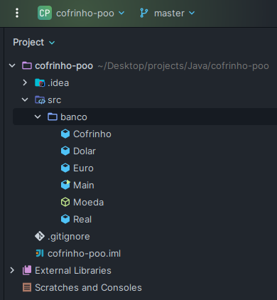

# Cofrinho Virtual - Trabalho de Programação Orientada a Objetos

Este repositório contém o código fonte e a documentação do trabalho desenvolvido para a disciplina de Programação Orientada a Objetos na universidade. O projeto consiste em um cofrinho virtual, implementado em Java, que permite adicionar, remover e listar moedas (Real, Dólar, Euro) e calcular o total em reais do cofrinho.

## Funcionalidades

- Adicionar moedas de Real, Dólar ou Euro ao cofrinho.
- Remover moedas do cofrinho.
- Listar as moedas presentes no cofrinho.
- Calcular o total em reais do cofrinho, considerando a conversão das moedas estrangeiras.

## Estrutura do projeto

## Stack's utilizadas

